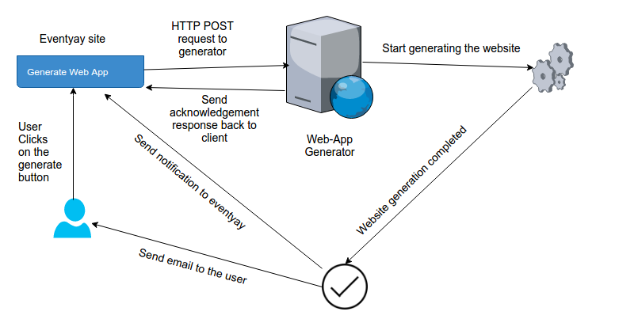
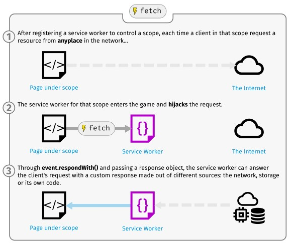
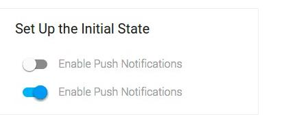
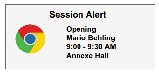

I have been selected to work on the Webapp component of the open event project under FOSSASIA and I couldn't be more excited about it. Thanks FOSSASIA!!

### A bit of background about the Open Event Project:

The Open Event Project offers event managers a platform to organize all kinds of events including concerts, conferences, summits and regular meetups. The components support organizers in all stages from event planning to publishing, marketing and ticket sales. Automated web and mobile apps help attendees to get information easily. There are four components of the project:

1. The Open Event Format Definition [JSON Schema Sample]

2. The Open Event Orga Server [Repository]

3. The Open Event Android App Generator [Repository]

4. The Open Event Web App Generator [Repository]


Actual events can be created very easily on the server. The data of these events can
then be extacted in the form of JSON zip and fed into the other components - open-event-webapp and the open-event-android
who will generate the event app on both the platforms. Every event can also be accessed through the server API.


### What will I be doing?


I will be working on the improvement and enhancement of the open-
event-webapp. Being involved in the development process for a while, I had some ideas to
further improve the project.

#### Integration with Orga-Server

One desired functionality that has been pending from a long time is the integration of the webapp with
the orga server. We want the give the organizer, the facility to generate the webapp for an event directly on the server itself,
at the click of a button. The proposed workflow can be described with the help of an image below




**Psuedo Code**:

POST Request sent from the orga-server:

```

import requests
web-app_link = "http://opev-event-webapp/generate"

data = {
    "email": "princu7@gmail.com",
    "name": "Open Event",
    "apiendpoint": "https://open-event.herokuapp.com/" + "api/v1/events/" + str(event_id),
    "datasource": "eventapi",
    "assetmode" : "download"
}

headers = {
    'cache-control': "no-cache",
    'content-type': "application/x-www-form-urlencoded"
}

r = requests.request("POST", app_link, data=data, headers=headers)

```

Route Handler on the webapp generator

```

app.post('/generate', function (req, res) {
  // Send Immediate response back to the client
  res.send("Website generation started. You'll get an email when it is ready");

  startCreatingWebsite(req, function(done) {
    // send a notification back to the orga server after succesful completion of the site generation
    sendBackNotification();
  });
});

```


#### Caching using service workers

Speed is a factor which is desired across most of the domains. No one likes slugginess. No one likes latency. The webpages generated
by the open-event-webapp are static in nature and can be hosted on any web location like FTP or Github Pages. This provides an ideal
scenario to apply caching with the help of serivce workers. Service workers are the heart of the Progressive web apps and are
basically JS scrips which run in the background and intercept the network requests and can respond with custom tailor
made responses. With the help of them, we can implement caching of assets and resources. When there is request for an asset,
we check our cache for that asset and if it exists, then it is directly returned instead of fetching it from the network.
When the cached assets increases, the dependecy on the network decreases to the point where no internet is required for the
app to run. That's the power of service workers. This diagram taken from the Mozilla documentation accurately captures the gist of service
workers:


**Psuedo Code**:

Installing and activating service workers

```

self.addEventListener('install', event => {
  // Do install stuff
});

self.addEventListener('activate', event => {
  // Do activate stuff: This will come later on.
  });

```

Using Caching:

```

self.addEventListener('fetch', function(resource) {
 if resourceBeenCached() {
   return cachedResource
 }
 else {
    fetchResourceFromNetwork()
    addResourceToCache()
 }

```

#### Push Notifications
The bookmark feature of web-app isn't much up to the mark. There are no notifications displayed for the starred sessions. How can we make this better? How can we implement real time live notifications?

Answer: Push Notifications. It is a new technology requiring the use of service workers.Web push notifications are clickable messages sent to a browser on your device. These notifications can only be sent to users who have subscribed for these notifications. As these notifications are pushed to subscriber’s browser, subscribers don’t have to be present on your website to receive these notifications. Users can subscribe and receive these notifications on mobile, desktop and tablet.



With the help of push notifications, we can send a reminder to the user/speaker before the start of a bookmarked session.

There are three factors involved with delivering a push notification:-

1. Push Notification Service: Each browser, including Chrome, Safari and Firefox have their own notification delivery service. Chrome uses Google Cloud Messaging ( and now Firebase Cloud Messaging ), Safari uses Apple Push Notification Service ( APNS ) and Firefox uses their own messaging server.

2. Service Worker Registration: User must register the service worker on the browser

3. User’s Subscription ID: Subscriber ID is generated when a user opts in to receive notifications from a specific website.

At the end of the summer, I hope we can show a notification similar to this:


